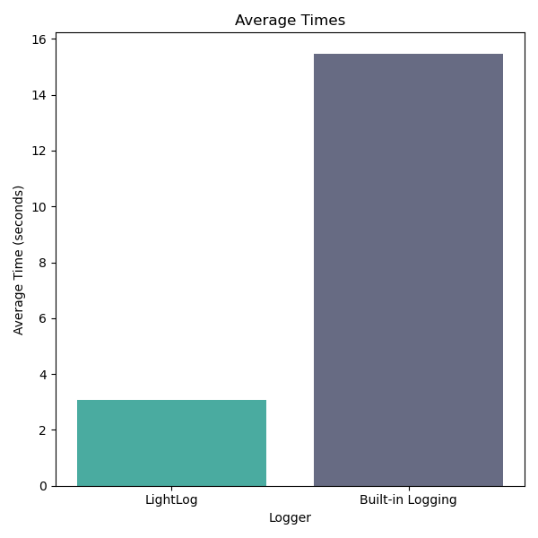
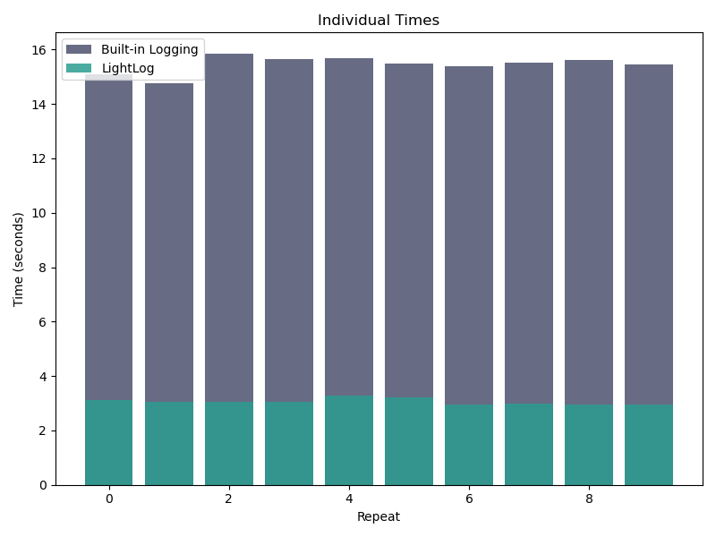

# LightLog

[](https://github.com/misaghsoltani/LightLog/actions/workflows/wheel.yml)
[](https://github.com/misaghsoltani/LightLog/actions/workflows/pip.yml)

<div align="center">
  
</div>

_LightLog_ is a lightweight, flexible, and efficient logging package for Python, built on a C++ core.
Originally developed to meet the logging needs of a personal project, its development was driven by a desire for a streamlined logging solution that balances performance and ease of use, and it is now shared with the community in the hopes of being a useful resource.

## Table of Contents

- [LightLog](#lightlog)
  - [Table of Contents](#table-of-contents)
  - [Features](#features)
  - [Installation](#installation)
  - [Usage](#usage)
    - [Basic Usage](#basic-usage)
    - [Distributed Computing with Manual Rank Setting](#distributed-computing-with-manual-rank-setting)
    - [Distributed Computing with Auto Rank Detection](#distributed-computing-with-auto-rank-detection)
    - [Distributed Computing with Specified Environment](#distributed-computing-with-specified-environment)
    - [Print Redirection](#print-redirection)
  - [API Reference](#api-reference)
    - [`Logger` Class](#logger-class)
      - [Parameters](#parameters)
    - [Methods](#methods)
  - [Performance](#performance)
    - [Benchmark](#benchmark)
      - [Benchmark Environment](#benchmark-environment)
      - [Benchmark Results](#benchmark-results)
    - [Summary](#summary)
  - [Contributing](#contributing)
  - [License](#license)

## Features

- Lightweight and efficient C++ core with Python bindings
- Support for both file and console logging
- Multiple log levels (DEBUG, INFO, WARNING, ERROR, CRITICAL)
- Rank-based logging for distributed systems
- Auto-detection of distributed environments (MPI, PyTorch, Horovod, SLURM, NCCL)
- Ability to redirect Python's print() function to the logger
- Support for logging to multiple files
- Versatile usage: can be used as a
  - Decorator to log function calls and outputs
  - Context manager to log specific code blocks or scopes
  - Traditional logger for explicit logging statements

## Installation

You can install _LightLog_ using pip:

```bash
pip install lightlog
```

## Usage

### Basic Usage

This section demonstrates the fundamental operations of the _LightLog_ library, including initializing a logger, logging messages with different levels, and using the default logging behavior.

```python
from lightlog import Logger

# Initialize logger
logger = Logger('LogName', 'log.txt')

# Log with warning level
logger.log("Print to screen and save to 'log.txt'", level=lightlog.WARNING)
# Output: 2024-09-8 17:34:16 | WARNING | LogName | Print to screen and save to 'log.txt'

# Log without specifying level
logger.log("Print to screen and save to 'log.txt'")
# Output: Print to screen and save to 'log.txt'

# Log with info level
logger.info("Print to screen and save to 'log.txt'")
# Output: 2024-09-8 17:34:48 | INFO | LogName | Print to screen and save to 'log.txt'
```

### Distributed Computing with Manual Rank Setting

This example shows how to use _LightLog_ in a distributed computing environment where you manually specify the rank and world size. This is useful when you want to control these parameters explicitly.

```python
from lightlog import Logger

# Initialize logger with manual rank setting
logger = Logger('LogName', 'log.txt', use_rank=True, rank=0, world_size=10)

# Log with warning level
logger.log("Print to screen and save to 'log.txt'", level=lightlog.WARNING)
# Output: [0/10] 2024-09-8 17:36:43 | WARNING | LogName | Print to screen and save to 'log.txt'

# Log without specifying level
logger.log("Print to screen and save to 'log.txt'")
# Output: [0/10] Print to screen and save to 'log.txt'
```

### Distributed Computing with Auto Rank Detection

This section illustrates how _LightLog_ can automatically detect rank and world size in an MPI environment. It uses environment variables to determine these values without manual specification.

Assume environment is 'mpirun', the environment variable `OMPI_COMM_WORLD_SIZE` is set to 34, and the environment variable `OMPI_COMM_WORLD_RANK` is set to 8

```python
from lightlog import Logger

# Initialize logger with auto rank detection
logger = Logger('LogName', 'log.txt', use_rank=True)

# Log without specifying level
logger.log("Print to screen and save to 'log.txt'")
# Output: [8/34] Print to screen and save to 'log.txt'

# Log with info level
logger.info("Print to screen and save to 'log.txt'")
# Output: [8/34] 2024-09-8 17:37:50 | INFO | LogName | Print to screen and save to 'log.txt'
```

### Distributed Computing with Specified Environment

This example demonstrates how to use _LightLog_ with a specific distributed computing environment, in this case, Torchrun. It shows how to configure the logger to detect rank and world size from Torchrun-specific environment variables.

Assume the environment is 'torchrun', the environment variable `RANK` is set to 8, and the environment variable `WORLD_SIZE` is set to 34

```python
from lightlog import Logger

# Initialize logger with specified environment
logger = Logger('LogName', 'log.txt', use_rank=True, auto_detect_env='torchrun')

# Log with critical level
logger.critical("Print to screen and save to 'log.txt'")
# Output: [8/34] 2024-09-8 17:38:56 | CRITICAL | LogName | Print to screen and save to 'log.txt'
```

### Print Redirection

This section shows how _LightLog_ can intercept and redirect print statements. This feature is useful when you want to capture all output, including from third-party libraries that use print statements, in your log file.

```python
from lightlog import Logger

# Initialize logger
logger = Logger('LogName', 'log.txt')

# Normal print
print("Print to the screen only")
# Output: Print to the screen only

# Redirect print to logger
logger.redirect_print()
print("Print to screen and save to 'log.txt'")
# Output: Print to screen and save to 'log.txt'

# Reset print to normal behavior
logger.reset_print()
print("Print to the screen only")
# Output: Print to the screen only
```

### Context Manager
The LightLog library allows for flexible logging configurations. You can use it directly or as a context manager for temporary logging redirection.

```python
import lightlog

# Initialize logger
logger = lightlog.Logger("ContextExample", "/path/to/log.txt", level=lightlog.NOTSET)

print("This prints to console")

# Using logger as a context manager
with logger:
    print("This prints to console and log file")

print("This prints to console again")
```

In this example, only the print statement within the `with` block is captured by the logger and written to both the console and the log file.

### Function Decorator
The `@log_prints` decorator can be used to automatically redirect all print statements within a function to a logger.

```python
@lightlog.log_prints(name="FunctionLogger", file_path="/path/to/log.txt", level=lightlog.INFO)
def example_function():
    print("This will be logged")

example_function()
```

When `example_function()` is called, its print statement will be logged at the INFO level.

### Class Decorator
You can also apply the `@log_prints` decorator to a class, which will affect all methods within the class.

```python
@lightlog.log_prints(name="ClassLogger", file_path="/path/to/log.txt")
class ExampleClass:
    def __init__(self):
        print("This will be logged")

    def method(self):
        print("This will also be logged")

my_instance = ExampleClass()
my_instance.method()
```

Both the `__init__` and `method` print statements will be captured by the logger.

### Using Existing Logger Instance
You can create a logger instance and reuse it with the decorator:

```python
logger = lightlog.Logger(name="ExistingLogger", file_path="/path/to/log.txt")

@lightlog.log_prints(logger_instance=logger)
def yet_another_example():
    print("This will use the existing logger")

yet_another_example()
```

This approach allows you to maintain consistent logging configurations across multiple functions or classes.

> [!NOTE]
>
> - If `use_rank` is set to `True`, the rank and world size label will be added to the log output.
> - The `level` parameter in `Logger` initialization sets the minimum logging level. `NOTSET` means all messages will be logged.
> - When using the `@log_prints` decorator, you can specify logging parameters or use an existing logger instance.
> - The file path in these examples is set to "/path/to/log.txt". In a real scenario, you would replace this with the actual path where you want to store your log file.

These examples demonstrate how LightLog can be integrated into various parts of your Python code to provide flexible logging capabilities.

## API Reference

### `Logger` Class

The `Logger` class is designed to provide flexible and efficient logging, especially in distributed environments. Below is a detailed description of its parameters and methods.

#### Parameters

- **`name: str`**  
  The name of the logger instance, typically used to identify the source of log messages.

- **`file_path: Optional[str] = None`**  
  Path to the log file. If not provided, logs are printed to the console.

- **`mode: str = 'a'`**  
  Mode for opening the log file. `'a'` for appending, `'w'` for overwriting.

- **`level: int = lightlog.NOTSET`**  
  Logging level. Set to `0` for no filtering (i.e., log everything).

- **`use_rank: bool = False`**  
  Enables rank-based logging for distributed systems.

- **`rank: Optional[int] = None`**  
  Manually set the process rank (useful for distributed configurations).

- **`world_size: Optional[int] = None`**  
  Total number of processes in distributed environments.

- **`auto_detect_env: Optional[str] = None`**  
  Automatically detect the environment for logging. Supported values include `'all'`, `'mpirun'`, `'torchrun'`, etc.

- **`log_rank: Optional[int] = None`**  
  The rank on which logging is performed. All other ranks will suppress logs.

### Methods

- **`log(*args, sep=" ", end="\n", level=lightlog.NOTSET, use_rank=False, new_file_path=None)`**  
  General logging method to log messages at a specific level.

  - `args`: Content of the log message.
  - `sep`: Separator between `args` (default is `" "`).
  - `end`: End character (default is newline).
  - `level`: Custom logging level for the message.
  - `use_rank`: Include the rank in the log message (default is `False`).
  - `new_file_path`: Temporarily set a new log file path for this message.

- **`debug(*args, sep=" ", end="\n", use_rank=False, new_file_path=None)`**  
  Log a debug-level message.

- **`info(*args, sep=" ", end="\n", use_rank=False, new_file_path=None)`**  
  Log an informational message.

- **`warning(*args, sep=" ", end="\n", use_rank=False, new_file_path=None)`**  
  Log a warning message.

- **`error(*args, sep=" ", end="\n", use_rank=False, new_file_path=None)`**  
  Log an error message.

- **`critical(*args, sep=" ", end="\n", use_rank=False, new_file_path=None)`**  
  Log a critical message.

- **`flush()`**  
  Flush the log buffer to ensure all pending log messages are written to the file or console.

- **`close()`**  
  Close the logger, releasing any associated resources.

- **`reconfigure(name: Optional[str] = None, new_file_path: Optional[str] = None, mode: str = 'a', level: Optional[int] = None, use_rank: Optional[bool] = None, rank: Optional[int] = None, world_size: Optional[int] = None, auto_detect_env: Optional[str] = None, log_rank: Optional[int] = None) -> None`**  
  Dynamically reconfigure the logger with new settings.

  - `name`: Change the logger's name.
  - `new_file_path`: Set a new file path for logging.
  - `mode`: Update the file open mode (`'a'` for append, `'w'` for overwrite).
  - `level`: Set a new logging level.
  - `use_rank`: Enable or disable rank-based logging.
  - `rank`: Update the process rank.
  - `world_size`: Adjust the total number of processes.
  - `auto_detect_env`: Set the environment for auto-detection (e.g., `'mpirun'`, `'torchrun'`).
  - `log_rank`: Specify the rank for active logging.

- **`redirect_print()`**  
  Redirect the standard `print()` function to use the logger for logging output.

- **`reset_print()`**  
  Restore the default behavior of the `print()` function, removing the logger redirection.

## Performance

_LightLog_ is optimized for speed and efficiency. Its C++ core ensures fast logging operations, while the Python interface provides ease of use. Below is a benchmark comparison between _LightLog_ and Python's built-in `logging` module.

You can view the full benchmark code at [`benchmark.py`](https://github.com/misaghsoltani/LightLog/blob/main/benchmark.py).

### Benchmark

#### Benchmark Environment

This benchmark was conducted on an **Apple M1 Max** chip. The test measures the time it takes to log 100,000 messages using both _LightLog_ and Python's built-in logger, repeated 10 times, with each run consisting of 10 iterations.

#### Benchmark Results

Below are the benchmark results comparing the two loggers across multiple runs:

```bash
$ python benchmark.py
2024-09-18 04:17:23,997 | light_logger | INFO | Log message 0
[...]
2024-09-18 04:17:54,587 | light_logger | INFO | Log message 99999
2024-09-18 04:17:54,587 | py_logger | INFO | Log message 0
[...]
2024-09-18 04:20:29,099 | py_logger | INFO | Log message 99999
---------- Benchmark Results -----------
Iterations: 100000
Runs per repeat: 10
Repeats: 10
LightLog times: ['3.125600 seconds', '3.039536 seconds', '3.036778 seconds', '3.040145 seconds', '3.293178 seconds', '3.218442 seconds', '2.954060 seconds', '2.987005 seconds', '2.937843 seconds', '2.956478 seconds']
LightLog average time: 3.058907 seconds
Built-in logging times: ['15.090291 seconds', '14.747250 seconds', '15.834340 seconds', '15.643067 seconds', '15.691300 seconds', '15.500472 seconds', '15.389877 seconds', '15.533213 seconds', '15.616875 seconds', '15.463194 seconds']
Built-in logging average time: 15.450988 seconds
----------------------------------------
```

<div align="center">
  <!--  &nbsp; &nbsp; -->
   &nbsp; &nbsp;
  <!--  &nbsp; &nbsp; -->
   &nbsp; &nbsp;
</div>

### Summary

The results show that **_LightLog_** is approximately **5x faster** than Python's built-in `logging` module, making it a more efficient choice for logging large volumes of messages.

## Contributing

If you find a bug or have a feature request, please open an issue on the GitHub repository. If you'd like to contribute code, please fork the repository and submit a pull request.

## License

_LightLog_ is released under the MIT License. See the LICENSE file for details.
